# Screens → routes

Every screen in the frontend, what it shows, and the endpoints that have to feed
it. Endpoint request/response shapes live in
**[API-CONTRACT.md](../API-CONTRACT.md)** — this document is the map from a
picture to the spec section, so you can see *why* each route exists before
reading it.

**Live:** https://bankole-app.vercel.app — click through it, it needs no login.

Screenshots are in [`screenshots/`](screenshots/), desktop at 1440px and mobile
at 390px, captured from the live deployment.

Everything currently runs on seeded data from `web/lib/mock-data.ts`. The
frontend keeps working with no backend attached, so nothing you build is a
blocker for the demo — it's all upside.

**Priority is `NEXT_PUBLIC_API_BASE_URL` + these three:** `GET /agents`,
`GET /projects/:id`, `POST /milestones/:id/approve`. Those three light up the
directory, the workspace, and the one interaction judges will actually watch.

---

## 1. Landing — `/`

Marketing page. Problem, mechanism, business model, survey quotes.

**No API needed.** Fully static. Ignore this one.

---

## 2. Agent directory — `/agents`

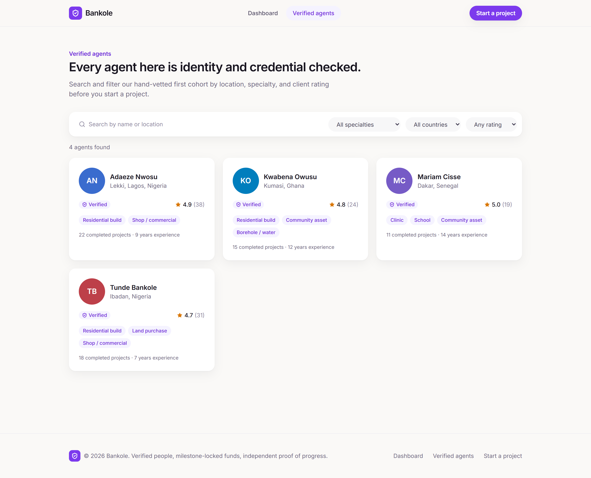

Searchable, filterable list of verified agents. This is the screen our survey
says matters most — verified agent profiles were the single most-requested
feature (6 of 10 respondents), so it's the highest-value thing to make real.

| Endpoint | Spec | What it does |
|---|---|---|
| `GET /agents` | §3 | Returns the list. Query params for `location`, `specialty`, `minRating`, `search`. |

**Sends:** query string only, no body.
**Logic:** filter and sort the agent table. Search should match name and
specialty. Nothing here is user-specific, so it can be unauthenticated.
**Returns:** array of agents — `id`, `name`, `initials`, `avatarHue`,
`location`, `specialties[]`, `rating`, `reviewCount`, `verified`,
`projectsCompleted`, `yearsActive`.

The UI renders `initials` + `avatarHue` as the avatar, so send them even though
they look cosmetic — there are no profile photos.

---

## 3. Agent profile — `/agents/:id`

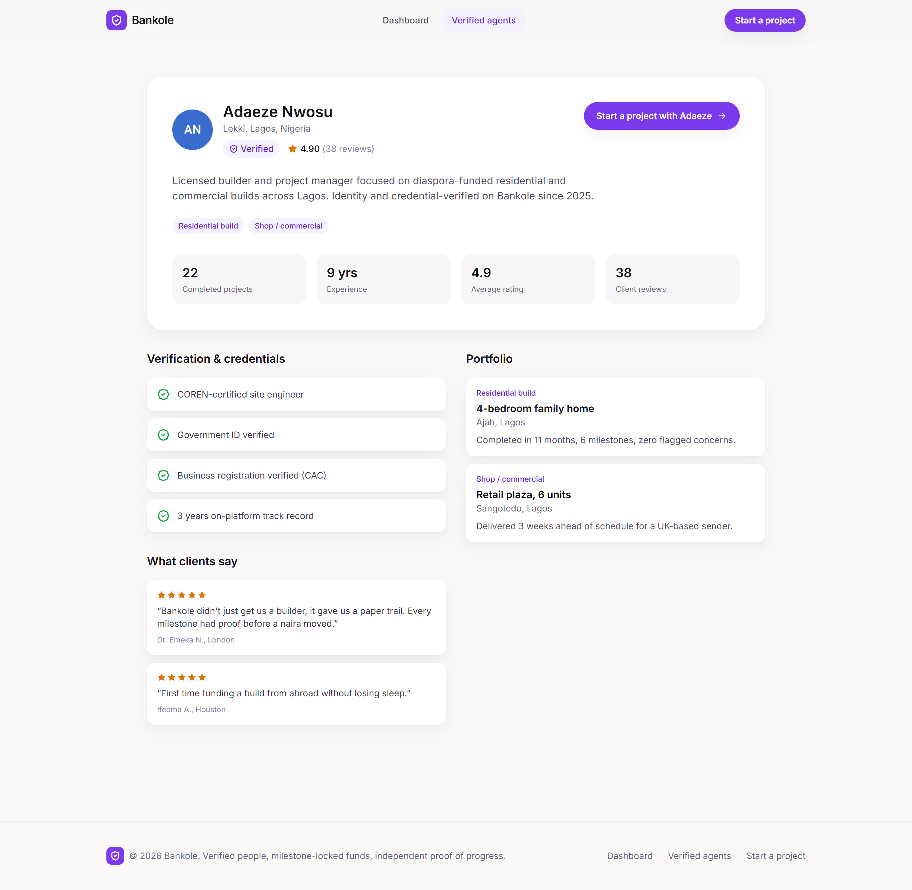

One agent in full: credentials, verification state, portfolio, client reviews.

| Endpoint | Spec | What it does |
|---|---|---|
| `GET /agents/:id` | §3 | Single agent, expanded. |

**Sends:** nothing, id in path.
**Logic:** 404 if the agent doesn't exist.
**Returns:** everything from the list view plus `bio`, `credentials[]`
(each with `label`, `issuer`, `verifiedOn`), `portfolio[]`, and `reviews[]`
(`author`, `rating`, `body`, `date`).

---

## 4. Sender dashboard — `/dashboard`

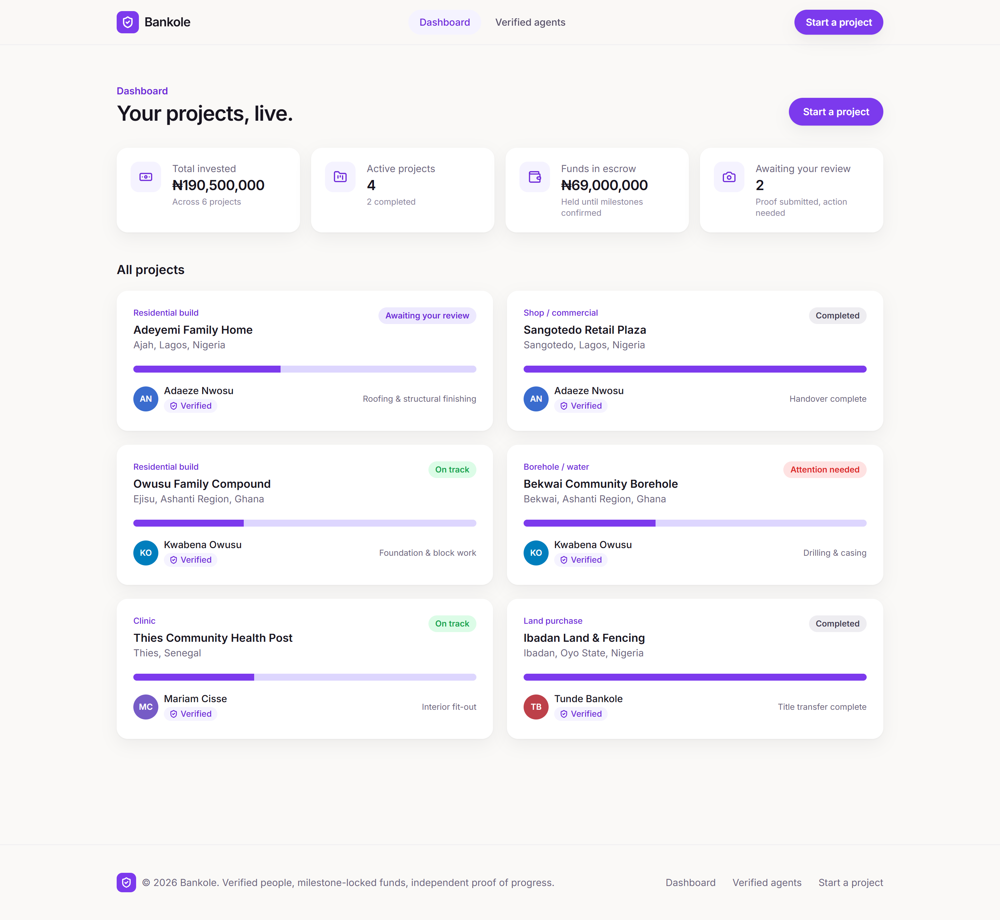

What a sender sees on login: every project they fund, money held vs released,
and anything waiting on them.

| Endpoint | Spec | What it does |
|---|---|---|
| `GET /dashboard/summary` | §8 | The four stat tiles at the top. |
| `GET /projects` | §4 | The project cards below them. |

**Sends:** nothing beyond the bearer token — the sender is identified by the
token, never by a query param.
**Logic:** scope both to the authenticated sender. `summary` aggregates across
their projects: total in escrow, total released, active project count, count of
items awaiting their approval.
**Returns:** `summary` gives the four totals; `projects` gives an array with
`id`, `name`, `assetType`, `location`, `agentId`, `totalBudget`,
`fundsReleased`, `fundsInEscrow`, `currentStage`, `status`, `startedOn`.

`status` drives the coloured pill and must be one of the §12 enum values
exactly — an unrecognised string renders blank.

---

## 5. Project workspace — `/projects/:id`

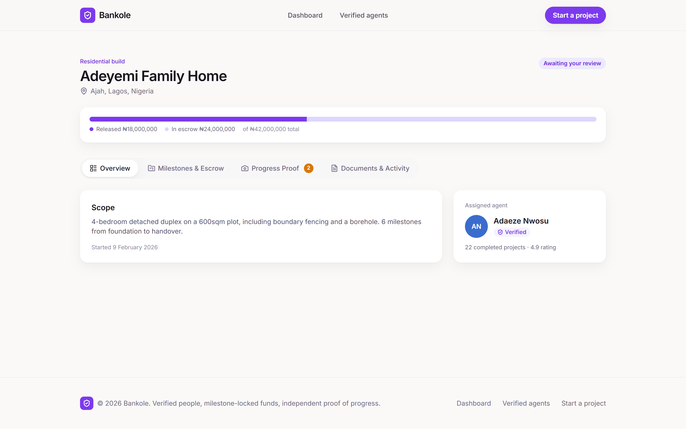

The core screen. Milestone timeline, budget split, submitted proof, activity
log, and the approve/flag actions that release money.

| Endpoint | Spec | What it does |
|---|---|---|
| `GET /projects/:id` | §4 | Project header and budget. |
| `GET /projects/:id/milestones` | §5 | The timeline. |
| `GET /projects/:id/proofs` | §6 | Photo/video evidence per milestone. |
| `GET /projects/:id/activity` | §7 | Audit trail. |
| `POST /milestones/:id/approve` | §5 | Sender accepts a stage. |
| `POST /milestones/:id/flag` | §5 | Sender disputes a stage. |
| `POST /milestones/:id/release` | §5 | Moves escrow to the agent. |

**Sends:** `approve` and `flag` take an optional `note`. `flag` should require
a reason.
**Logic:** this is the part worth getting right. Only the owning sender may
approve, flag, or release. Approving a milestone marks it complete and makes
its escrow amount releasable; releasing moves money and appends to the activity
log. **Ownership failures return 403, not 404** — see §2; we decided resources
shouldn't be probeable.
**Returns:** the updated milestone, so the UI can re-render without refetching
the whole project.

If you build one write endpoint, make it `approve` — it's the moment the demo
is built around.

---

## 6. Guided project creation — `/projects/new`

Five steps. The whole flow is client-side until the last click, so you only
need **one** endpoint for it.

### Step 1 — asset type, name, location

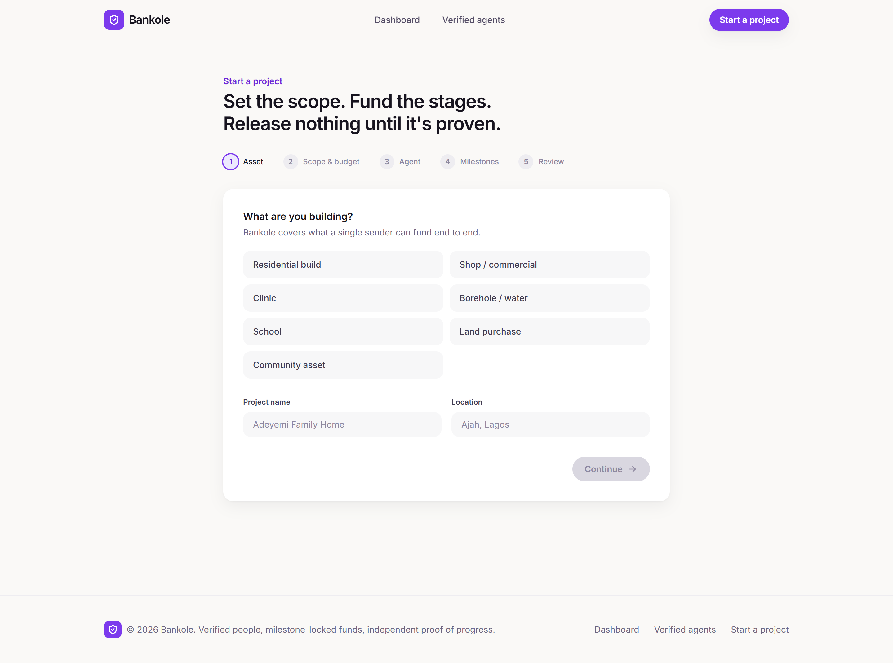
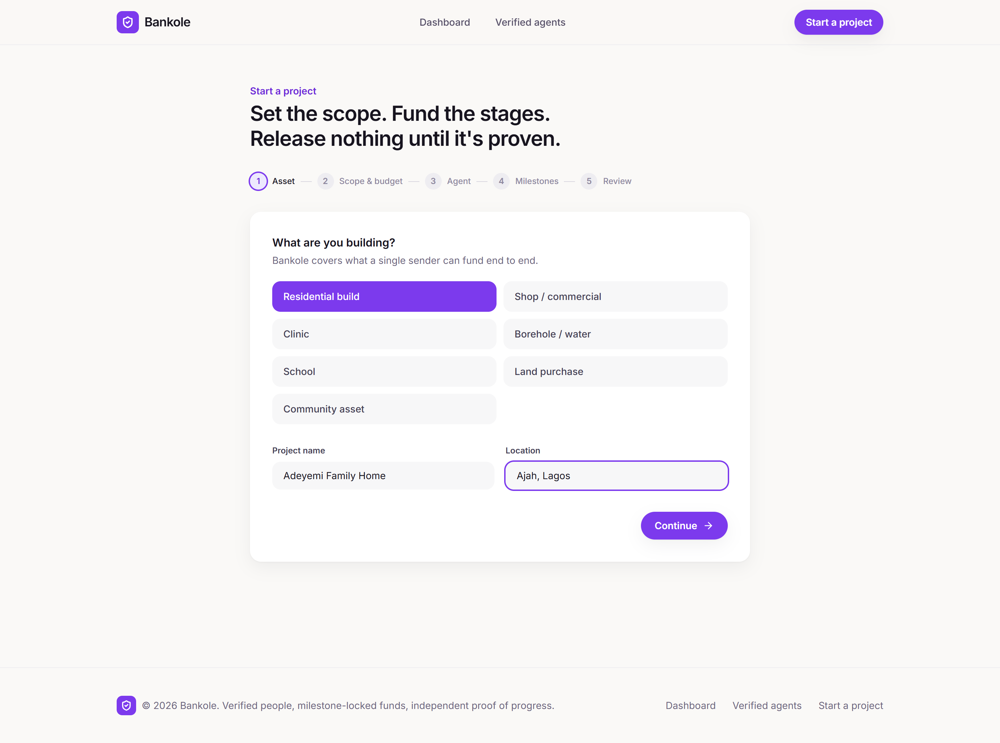

### Step 2 — scope and budget

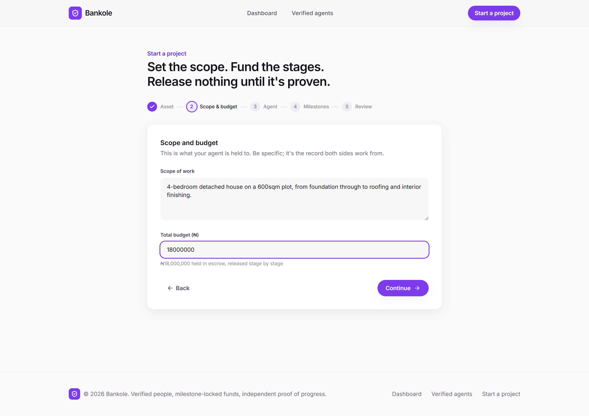

Budget has a minimum so it can be split across stages.

### Step 3 — choose a verified agent

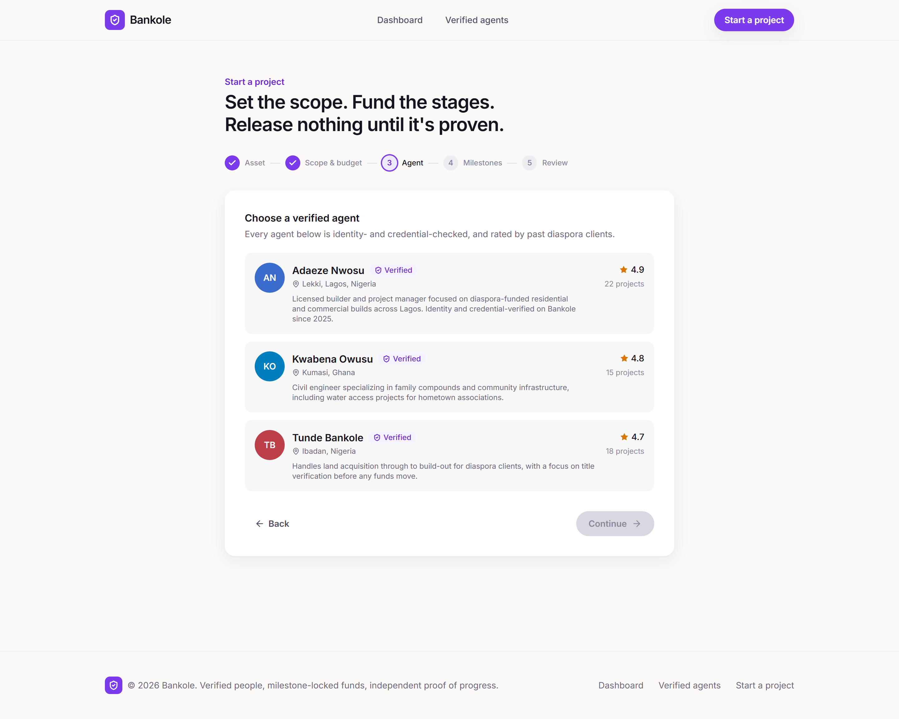
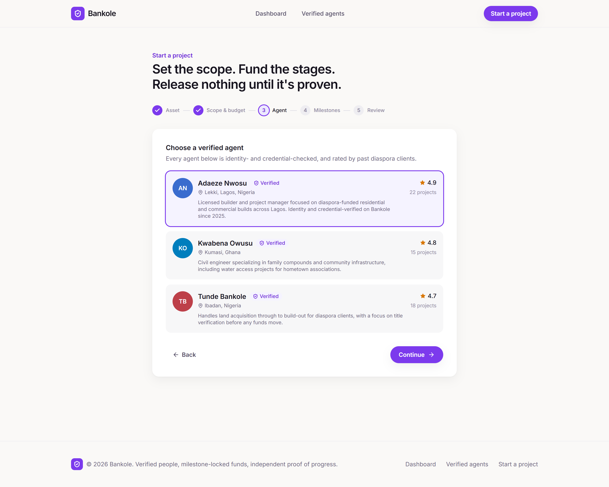

Filtered by asset type. Uses the same `GET /agents` as screen 2.

### Step 4 — milestone plan

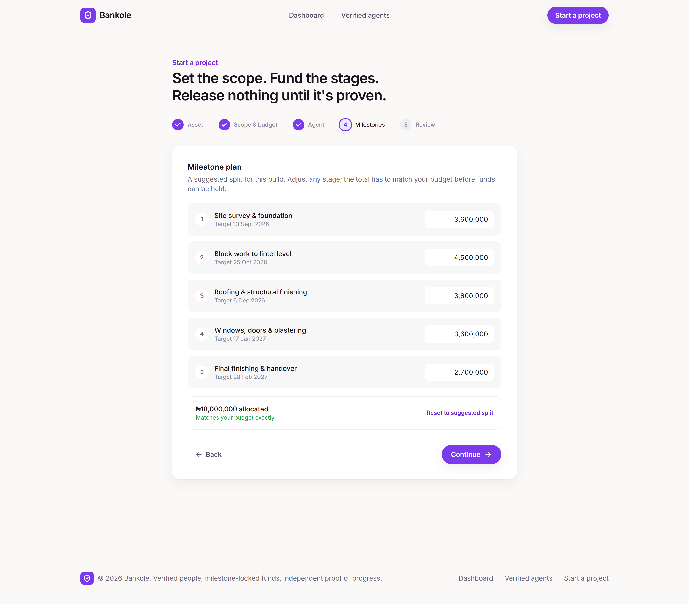

The frontend suggests a stage split from the asset type and budget, and the
sender can edit any amount. **The stage totals must equal the budget before the
form will submit** — that check is already enforced client-side, but re-check it
server-side.

### Step 5 — review and fund

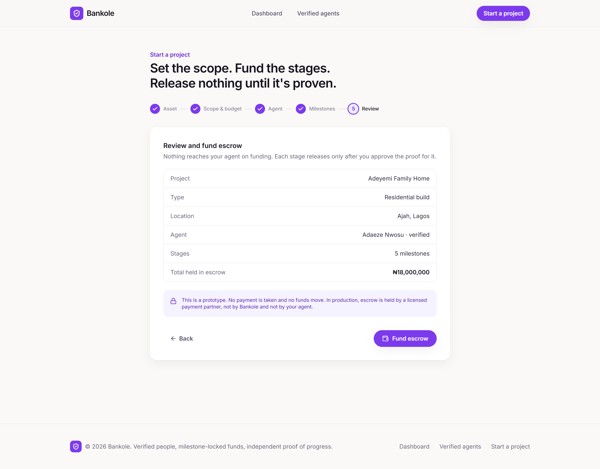

### Confirmation

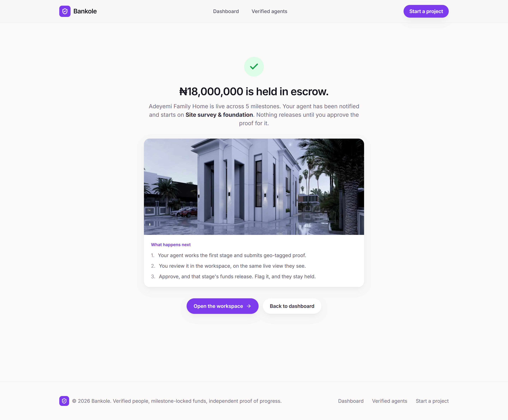

| Endpoint | Spec | What it does |
|---|---|---|
| `GET /agents` | §3 | Populates step 3. |
| `POST /projects` | §4 | Submitted once, at "Fund escrow". |

**Sends:** one payload with the project *and* its milestone plan together —
`name`, `assetType`, `location`, `scope`, `totalBudget`, `agentId`, and
`milestones[]` where each entry is `{ stage, escrowAmount, dueDate }`.
**Logic:** create project and milestones in a single transaction. Reject if
milestone amounts don't sum to `totalBudget`, if `agentId` doesn't exist, or if
budget is under the minimum. First milestone starts `in_progress`, the rest
`pending`.
**Returns:** the created project including its generated `id` — the UI
redirects straight to `/projects/:id`, so a missing id breaks the flow.

Right now this writes to `localStorage` (see `web/lib/draft-projects.ts`), which
is why created projects survive a refresh but not a different browser. Swapping
in `POST /projects` replaces that entirely.

---

## Mobile

Every screen is responsive; these are at 390px.

| | |
|---|---|
|  | 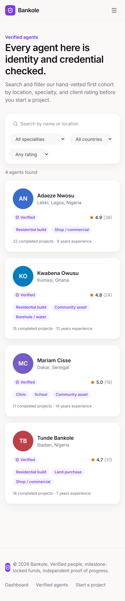 |
| 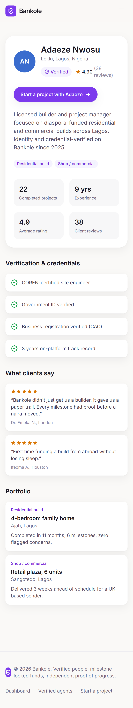 | 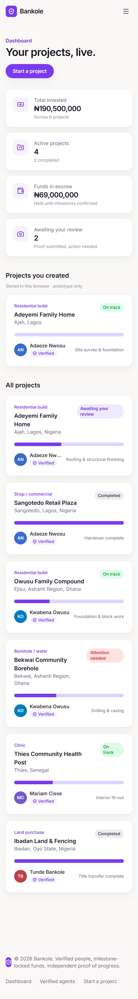 |
| 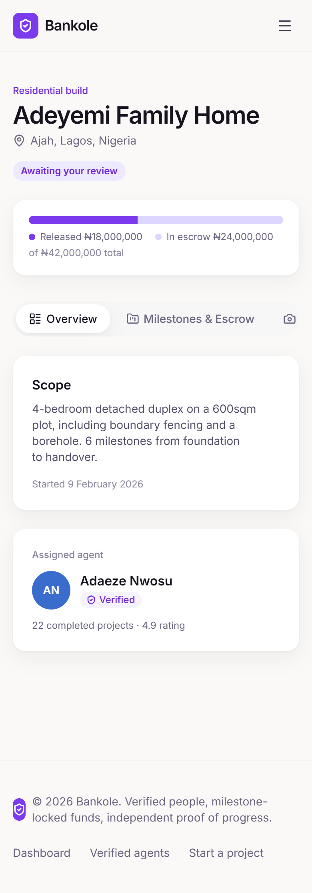 | 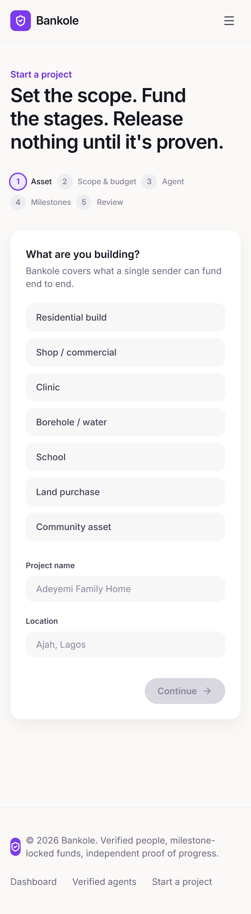 |

---

## Two things to push back on

Per the handoff note, tell me now rather than on the 7th if either of these is
wrong:

1. **Auth (§2).** Bearer tokens, `sender` / `agent` roles, 403 on ownership
   failure. If sessions or something simpler fits your timeline, say so and the
   frontend adapts.
2. **Enum values (§12).** The UI maps them to labels and colours. A status
   string that doesn't match exactly renders as a blank pill — this is the
   single most likely thing to silently break when we connect the two halves.
